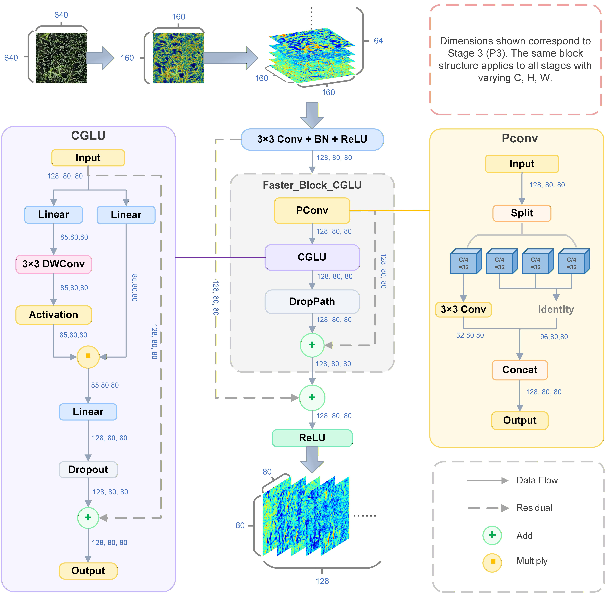
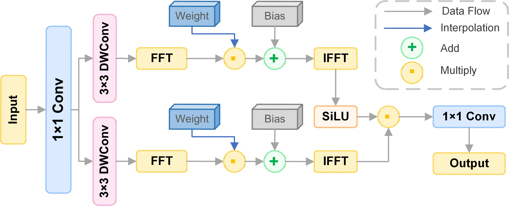
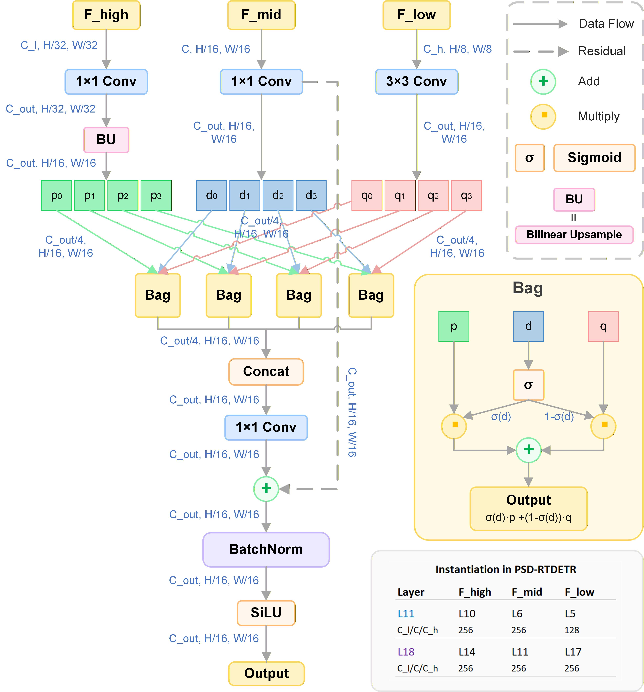

# PSD-RTDETR

**PSD-RTDETR: A Lightweight Real-Time Detection Transformer for Wild Arrowhead Weed Identification in Paddy Fields with Edge Deployment on Ascend NPU**

[](LICENSE)

> Lingzhen Meng, Yixiao Li, Hangbiao Ke, Tongyu Xu, Zhonghui Guo*, Fenghua Yu*
>
> Shenyang Agricultural University

## Highlights

PSD-RTDETR improves [RT-DETR-R18](https://github.com/lyuwenyu/RT-DETR) with three synergistic modules along the feature flow direction of **"extraction → interaction → fusion"**:

- A partial-gated backbone module cuts parameters by 22.5% with no accuracy loss.
- Spectral frequency modulation in the encoder sharpens crop-weed discrimination.
- Channel-grouped adaptive fusion substantially boosts dense small-target recall.
- Two-stage compression achieves 4.25× size reduction with 10.87 FPS on NPU edge.

## Architecture

<p align="center">
  
</p>


<details>
<summary>Data flow</summary>

```python
Input (3, 640, 640)
  → ConvNormLayer stem (→ 64ch) → MaxPool (P2/4)
  → 4× Blocks with PCGLU → P3/8, P4/16, P5/32
  → Conv 1×1 input projection (→ 256ch)
  → AIFI_SEFFN transformer encoder (spectral FFN + 2D sincos positional encoding)
  → 2× DSFD multi-scale fusion with RepC3 refinement
  → RTDETRDecoder (3 deformable decoder layers, 300 queries, 8 heads)
```

</details>

## Module Details

### PCGLU — Lightweight Backbone Block

<p align="center">
  
</p>


Replaces the standard ResNet BasicBlock with combined PConv (1/4 channel partial convolution for spatial mixing) + CGLU (gated linear unit for channel mixing). Compresses backbone parameters from 19.87M to 15.40M and GFLOPs from 56.9 to 46.2.

### SEFFN — Spectral Enhanced Feed-Forward Network

<p align="center">
  
</p>


Replaces the standard MLP FFN in the AIFI encoder with an FFT-based spectral network. Dilated depthwise convolution captures local features, while 2D FFT with learnable frequency-domain weights enables global spatial structure modeling. **+1.20 pp mAP with negligible overhead.**

### DSFD — Dimension-Aware Selective Fusion Decoder

<p align="center">
  
</p>


Three-input multi-scale fusion module. Divides features into 4 channel groups and applies Bag (Boundary-Aware Guided) soft-gating attention per group. Deployed at two fusion nodes forming a "focusing → diffusion" information flow. **+1.88 pp mAP, +1.32 pp Recall.**

## Ablation Study

| PCGLU | SEFFN | DSFD | Params (M) | GFLOPs | mAP@0.5 (%) |
| :---: | :---: | :--: | :--------: | :----: | :---------: |
|       |       |      |   19.87    |  56.9  |    82.69    |
|   ✓   |       |      |   15.40    |  46.2  |    83.29    |
|       |   ✓   |      |   19.75    |  56.8  |    83.89    |
|       |       |  ✓   |   21.17    |  63.4  |    84.57    |
|   ✓   |   ✓   |      |   15.28    |  46.1  |    84.15    |
|   ✓   |       |  ✓   |   16.70    |  52.6  |    84.79    |
|       |   ✓   |  ✓   |   21.05    |  63.3  |    85.09    |
|   ✓   |   ✓   |  ✓   |   16.58    |  52.5  |  **85.77**  |

## Quick Start

### Installation

```bash
git clone https://github.com/sistim1999/PSD-RTDETR.git
cd PSD-RTDETR
pip install -r requirements.txt
```

### Integration into Ultralytics

The proposed modules need to be registered into the Ultralytics framework. See [**docs/integration.md**](docs/integration.md) for step-by-step instructions.

### Training

```python
from ultralytics import RTDETR

model = RTDETR('ultralytics/cfg/models/PSD-RTDETR.yaml')
model.train(data='your_dataset.yaml', epochs=200, batch=8, device='0')
```

Or use the provided script:

```bash
python train.py
```

### Validation

```bash
yolo task=detect mode=val model=runs/train/exp/weights/best.pt data=your_dataset.yaml
```

### Key Training Settings

| Parameter | Value | Note |
|-----------|-------|------|
| `optimizer` | AdamW | |
| `lr0` | 0.0001 | |
| `batch` | 8 | |
| `amp` | False | RT-DETR produces NaN with AMP |
| `warmup_epochs` | 2000 | Iterations, not epochs |
| `mosaic` | 0.0 | |

## Citation

If you find this work useful, please cite:

```bibtex
@article{meng2026psdrtdetr,
  title={PSD-RTDETR: A lightweight real-time detection Transformer for wild arrowhead weed identification in paddy fields with edge deployment on Ascend NPU},
  author={Meng, Lingzhen and Li, Yixiao and Ke, Hangbiao and Xu, Tongyu and Guo, Zhonghui and Yu, Fenghua},
  journal={Artificial Intelligence in Agriculture},
  year={2026},
  note={Under review}
}
```

## Acknowledgements

This research was supported by the National Natural Science Foundation of China General Program (32572182).

## License

This project is licensed under the [AGPL-3.0 License](LICENSE), consistent with the Ultralytics framework it builds upon.
